## Exploratory Data Analysis (EDA) and Data Preparation

Dataset:
* Loan Status Data for Credit Scoring
* Filename: loans_train.csv
* Target variable: Loan_Status

Import libraries


```python
import numpy as np
import pandas as pd
import matplotlib.pyplot as plt
import seaborn as sns
sns.set_style("whitegrid")
sns.set_context("paper", font_scale=1.0) 

%matplotlib inline
```


```python
# Set Options for display
pd.options.display.max_rows = 1000
pd.options.display.max_columns = 100
pd.options.display.float_format = '{:.2f}'.format

#Filter Warnings
import warnings
warnings.filterwarnings('ignore')
```

Load the dataset
* Specify the parameters (filepath, index column)
* Check for Date-Time Columns to Parse Dates
* Check Encoding if file does not load correctly


```python
# to check your working directory
%pwd

# to change your working directory, use
# %cd
```


    'C:\\Users\\cbaruc\\Downloads\\EDA'


```python
df = pd.read_csv('loans_train.csv')
```

Describe the data

Verifying the data:
Look out for the following
* Unexpected missing values
* Incorrect or unexpected data types and format
* Duplicates
* Unexpected dimesions (i.e. missing rows or columns)
* Incorrect spelling
* Mixed cases for strings
* Unexpected outliers or anomalous values
* Inconsistent or incorrect units of measurements


```python
# Check for unexpected missing values
total = df.isnull().sum().sort_values(ascending=False)
total
```


    Credit_History       50
    Self_Employed        32
    LoanAmount           22
    Dependents           15
    Loan_Amount_Term     14
    Gender               13
    Married               3
    Loan_ID               0
    Education             0
    ApplicantIncome       0
    CoapplicantIncome     0
    Property_Area         0
    Loan_Status           0
    dtype: int64


```python
# Check for Incorrect or unexpected data type & format
df.dtypes
```


    Loan_ID               object
    Gender                object
    Married               object
    Dependents            object
    Education             object
    Self_Employed         object
    ApplicantIncome        int64
    CoapplicantIncome    float64
    LoanAmount           float64
    Loan_Amount_Term     float64
    Credit_History       float64
    Property_Area         object
    Loan_Status           object
    dtype: object


```python
# Check for duplicates
df.duplicated().value_counts()
```


    False    614
    Name: count, dtype: int64


```python
# Data Preparation - Handle Duplicates
df.drop_duplicates(inplace=True)
```


```python
# Check Categorical Column Values
df.select_dtypes(include=['object']).head()
```


<div>
<style scoped>
    .dataframe tbody tr th:only-of-type {
        vertical-align: middle;
    }

    .dataframe tbody tr th {
        vertical-align: top;
    }

    .dataframe thead th {
        text-align: right;
    }
</style>
<table border="1" class="dataframe">
  <thead>
    <tr style="text-align: right;">
      <th></th>
      <th>Loan_ID</th>
      <th>Gender</th>
      <th>Married</th>
      <th>Dependents</th>
      <th>Education</th>
      <th>Self_Employed</th>
      <th>Property_Area</th>
      <th>Loan_Status</th>
    </tr>
  </thead>
  <tbody>
    <tr>
      <th>0</th>
      <td>LP001002</td>
      <td>Male</td>
      <td>No</td>
      <td>0</td>
      <td>Graduate</td>
      <td>No</td>
      <td>Urban</td>
      <td>Y</td>
    </tr>
    <tr>
      <th>1</th>
      <td>LP001003</td>
      <td>Male</td>
      <td>Yes</td>
      <td>1</td>
      <td>Graduate</td>
      <td>No</td>
      <td>Rural</td>
      <td>N</td>
    </tr>
    <tr>
      <th>2</th>
      <td>LP001005</td>
      <td>Male</td>
      <td>Yes</td>
      <td>0</td>
      <td>Graduate</td>
      <td>Yes</td>
      <td>Urban</td>
      <td>Y</td>
    </tr>
    <tr>
      <th>3</th>
      <td>LP001006</td>
      <td>Male</td>
      <td>Yes</td>
      <td>0</td>
      <td>Not Graduate</td>
      <td>No</td>
      <td>Urban</td>
      <td>Y</td>
    </tr>
    <tr>
      <th>4</th>
      <td>LP001008</td>
      <td>Male</td>
      <td>No</td>
      <td>0</td>
      <td>Graduate</td>
      <td>No</td>
      <td>Urban</td>
      <td>Y</td>
    </tr>
  </tbody>
</table>
</div>


```python
# Check for misspellings and mixed cases for Categorical Data
df.select_dtypes(include=['object']).describe()
```


<div>
<style scoped>
    .dataframe tbody tr th:only-of-type {
        vertical-align: middle;
    }

    .dataframe tbody tr th {
        vertical-align: top;
    }

    .dataframe thead th {
        text-align: right;
    }
</style>
<table border="1" class="dataframe">
  <thead>
    <tr style="text-align: right;">
      <th></th>
      <th>Loan_ID</th>
      <th>Gender</th>
      <th>Married</th>
      <th>Dependents</th>
      <th>Education</th>
      <th>Self_Employed</th>
      <th>Property_Area</th>
      <th>Loan_Status</th>
    </tr>
  </thead>
  <tbody>
    <tr>
      <th>count</th>
      <td>614</td>
      <td>601</td>
      <td>611</td>
      <td>599</td>
      <td>614</td>
      <td>582</td>
      <td>614</td>
      <td>614</td>
    </tr>
    <tr>
      <th>unique</th>
      <td>614</td>
      <td>2</td>
      <td>2</td>
      <td>4</td>
      <td>2</td>
      <td>2</td>
      <td>3</td>
      <td>2</td>
    </tr>
    <tr>
      <th>top</th>
      <td>LP001002</td>
      <td>Male</td>
      <td>Yes</td>
      <td>0</td>
      <td>Graduate</td>
      <td>No</td>
      <td>Semiurban</td>
      <td>Y</td>
    </tr>
    <tr>
      <th>freq</th>
      <td>1</td>
      <td>489</td>
      <td>398</td>
      <td>345</td>
      <td>480</td>
      <td>500</td>
      <td>233</td>
      <td>422</td>
    </tr>
  </tbody>
</table>
</div>


```python
# Handle date features if any
try:
    df['Year'] = df.Date.dt.year
    df['Month'] = df.Date.dt.month
    df['Day']=df.Date.dt.day
    df['Week'] = df.Date.dt.isocalendar().week

except:
    print("No date features")
```

    No date features
    

Visualize & Analyze Univariate Numeric Variables


```python
df_num = df.select_dtypes(include=['float64','int64'])
df_num.describe()
```


<div>
<style scoped>
    .dataframe tbody tr th:only-of-type {
        vertical-align: middle;
    }

    .dataframe tbody tr th {
        vertical-align: top;
    }

    .dataframe thead th {
        text-align: right;
    }
</style>
<table border="1" class="dataframe">
  <thead>
    <tr style="text-align: right;">
      <th></th>
      <th>ApplicantIncome</th>
      <th>CoapplicantIncome</th>
      <th>LoanAmount</th>
      <th>Loan_Amount_Term</th>
      <th>Credit_History</th>
    </tr>
  </thead>
  <tbody>
    <tr>
      <th>count</th>
      <td>614.00</td>
      <td>614.00</td>
      <td>592.00</td>
      <td>600.00</td>
      <td>564.00</td>
    </tr>
    <tr>
      <th>mean</th>
      <td>5403.46</td>
      <td>1621.25</td>
      <td>146.41</td>
      <td>342.00</td>
      <td>0.84</td>
    </tr>
    <tr>
      <th>std</th>
      <td>6109.04</td>
      <td>2926.25</td>
      <td>85.59</td>
      <td>65.12</td>
      <td>0.36</td>
    </tr>
    <tr>
      <th>min</th>
      <td>150.00</td>
      <td>0.00</td>
      <td>9.00</td>
      <td>12.00</td>
      <td>0.00</td>
    </tr>
    <tr>
      <th>25%</th>
      <td>2877.50</td>
      <td>0.00</td>
      <td>100.00</td>
      <td>360.00</td>
      <td>1.00</td>
    </tr>
    <tr>
      <th>50%</th>
      <td>3812.50</td>
      <td>1188.50</td>
      <td>128.00</td>
      <td>360.00</td>
      <td>1.00</td>
    </tr>
    <tr>
      <th>75%</th>
      <td>5795.00</td>
      <td>2297.25</td>
      <td>168.00</td>
      <td>360.00</td>
      <td>1.00</td>
    </tr>
    <tr>
      <th>max</th>
      <td>81000.00</td>
      <td>41667.00</td>
      <td>700.00</td>
      <td>480.00</td>
      <td>1.00</td>
    </tr>
  </tbody>
</table>
</div>


```python
# Plot histograms, distplots, box plots, and/or density plots
df.ApplicantIncome.hist() # histograms
```


    <Axes: >


    
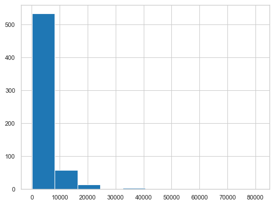
    


```python
sns.distplot(df['CoapplicantIncome']) # distplots
```


    <Axes: xlabel='CoapplicantIncome', ylabel='Density'>


    
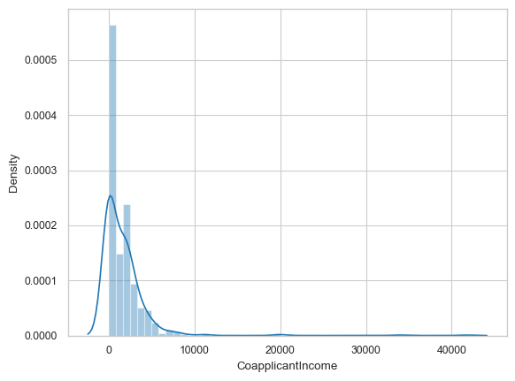
    


```python
sns.boxplot(df['LoanAmount']) # boxplots
```


    <Axes: >


    
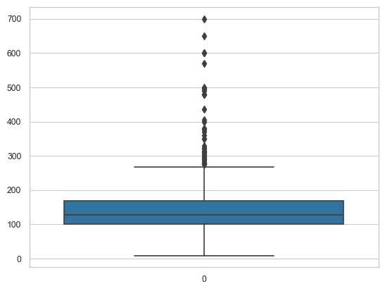
    


```python
sns.kdeplot(df.Loan_Amount_Term) # density plot
```


    <Axes: xlabel='Loan_Amount_Term', ylabel='Density'>


    
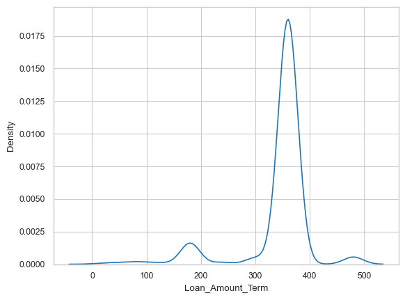
    


Data Preparation - Handle unexpected outliers


```python
# Use the function to handle unexpected outliers

def remove_Outliers(df,col_name):
    print("Orig DF Size:"+ str(df.shape) )
    Q1 = np.quantile(df[col_name],0.25)

    Q3 = np.quantile(df[col_name],0.75)

    IQR = Q3 - Q1

    lower_limit = Q1 - (1.5*IQR)
    upper_limit = Q3 + (1.5*IQR)

    print("Lower fence: %.2f" % lower_limit)
    print("Upper fence: %.2f" % upper_limit)
    
    df_new = df[(df[col_name] > lower_limit) & (df[col_name] < upper_limit)]
    print("New DF Size:"+ str(df_new.shape) )
    return df_new
```


```python
df.shape
```


    (614, 13)


```python
df_temp = remove_Outliers(df, 'ApplicantIncome')
df_temp.shape
```

    Orig DF Size:(614, 13)
    Lower fence: -1498.75
    Upper fence: 10171.25
    New DF Size:(564, 13)
    


    (564, 13)


Visualize & Analyze Univariate Categorical Variables


```python
df_cat = df_temp.select_dtypes(include=['object'])
df_cat.describe()
```


<div>
<style scoped>
    .dataframe tbody tr th:only-of-type {
        vertical-align: middle;
    }

    .dataframe tbody tr th {
        vertical-align: top;
    }

    .dataframe thead th {
        text-align: right;
    }
</style>
<table border="1" class="dataframe">
  <thead>
    <tr style="text-align: right;">
      <th></th>
      <th>Loan_ID</th>
      <th>Gender</th>
      <th>Married</th>
      <th>Dependents</th>
      <th>Education</th>
      <th>Self_Employed</th>
      <th>Property_Area</th>
      <th>Loan_Status</th>
    </tr>
  </thead>
  <tbody>
    <tr>
      <th>count</th>
      <td>564</td>
      <td>554</td>
      <td>561</td>
      <td>550</td>
      <td>564</td>
      <td>534</td>
      <td>564</td>
      <td>564</td>
    </tr>
    <tr>
      <th>unique</th>
      <td>564</td>
      <td>2</td>
      <td>2</td>
      <td>4</td>
      <td>2</td>
      <td>2</td>
      <td>3</td>
      <td>2</td>
    </tr>
    <tr>
      <th>top</th>
      <td>LP001002</td>
      <td>Male</td>
      <td>Yes</td>
      <td>0</td>
      <td>Graduate</td>
      <td>No</td>
      <td>Semiurban</td>
      <td>Y</td>
    </tr>
    <tr>
      <th>freq</th>
      <td>1</td>
      <td>451</td>
      <td>364</td>
      <td>321</td>
      <td>432</td>
      <td>467</td>
      <td>215</td>
      <td>389</td>
    </tr>
  </tbody>
</table>
</div>


```python
# Plot barplots, countplots
gender_counts = df_cat.groupby('Gender').size().reset_index(name='Count')
sns.barplot(x='Count', y='Gender', data=gender_counts) # barplots
```


    <Axes: xlabel='Count', ylabel='Gender'>


    
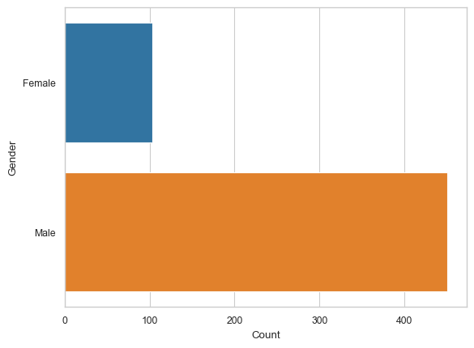
    


```python
# Plot barplots, countplots
sns.countplot(x='Dependents', data = df_cat) # countplots
```


    <Axes: xlabel='Dependents', ylabel='count'>


    
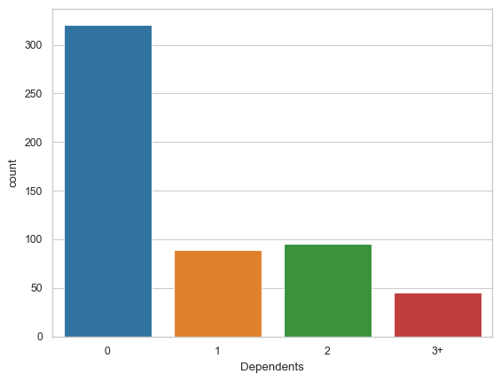
    


Run Multivariate analysis and plots


```python
# Check correlation by computing and plotting correlation matrix
corrmat = df_temp.corr(numeric_only=True)
corrmat
```


<div>
<style scoped>
    .dataframe tbody tr th:only-of-type {
        vertical-align: middle;
    }

    .dataframe tbody tr th {
        vertical-align: top;
    }

    .dataframe thead th {
        text-align: right;
    }
</style>
<table border="1" class="dataframe">
  <thead>
    <tr style="text-align: right;">
      <th></th>
      <th>ApplicantIncome</th>
      <th>CoapplicantIncome</th>
      <th>LoanAmount</th>
      <th>Loan_Amount_Term</th>
      <th>Credit_History</th>
    </tr>
  </thead>
  <tbody>
    <tr>
      <th>ApplicantIncome</th>
      <td>1.00</td>
      <td>-0.18</td>
      <td>0.49</td>
      <td>-0.04</td>
      <td>0.05</td>
    </tr>
    <tr>
      <th>CoapplicantIncome</th>
      <td>-0.18</td>
      <td>1.00</td>
      <td>0.34</td>
      <td>-0.06</td>
      <td>-0.00</td>
    </tr>
    <tr>
      <th>LoanAmount</th>
      <td>0.49</td>
      <td>0.34</td>
      <td>1.00</td>
      <td>0.07</td>
      <td>-0.01</td>
    </tr>
    <tr>
      <th>Loan_Amount_Term</th>
      <td>-0.04</td>
      <td>-0.06</td>
      <td>0.07</td>
      <td>1.00</td>
      <td>-0.02</td>
    </tr>
    <tr>
      <th>Credit_History</th>
      <td>0.05</td>
      <td>-0.00</td>
      <td>-0.01</td>
      <td>-0.02</td>
      <td>1.00</td>
    </tr>
  </tbody>
</table>
</div>


```python
sns.heatmap(corrmat,  cmap="vlag", center = 0,  vmax=1, square=True, linewidths=.5)
```


    <Axes: >


    
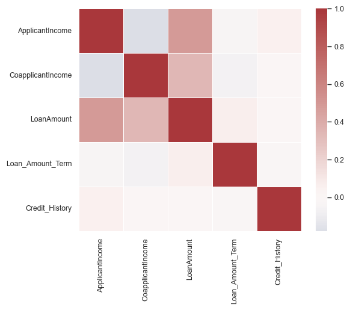
    


```python
corr = corrmat.sort_values('ApplicantIncome', ascending=False)
sns.barplot(x = corr.ApplicantIncome[1:], y = corr.index[1:], orient='h')
```


    <Axes: xlabel='ApplicantIncome'>


    
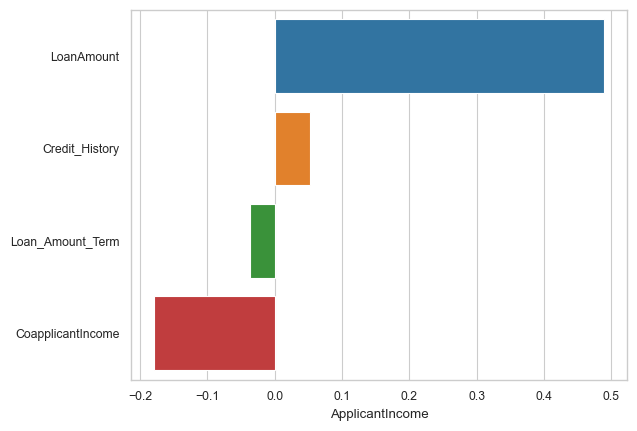
    


Plot Quantitative vs. Quantitative values together, any observations/insights?


```python
# Plot scatterplots, jointplots, regplots, and pairplots if needed
sns.scatterplot(x='LoanAmount', y='ApplicantIncome', data = df_temp) # scatterplots
```


    <Axes: xlabel='LoanAmount', ylabel='ApplicantIncome'>


    
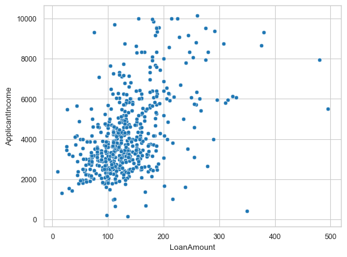
    


```python
sns.scatterplot(x='LoanAmount', y='Loan_Amount_Term', data = df_temp) #scatterplots
```


    <Axes: xlabel='LoanAmount', ylabel='Loan_Amount_Term'>


    
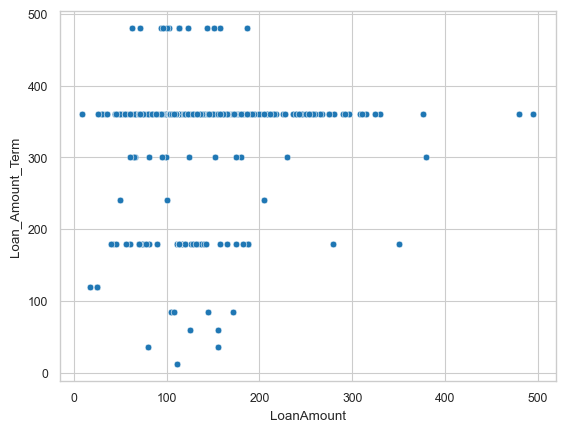
    


```python
sns.regplot(x='LoanAmount', y='ApplicantIncome', data = df_temp) #regplots
```


    <Axes: xlabel='LoanAmount', ylabel='ApplicantIncome'>


    
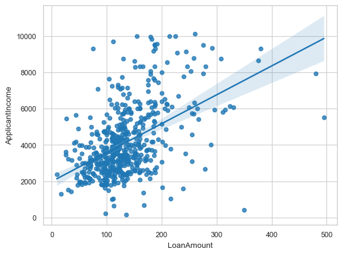
    


```python
sns.jointplot(x='LoanAmount', y='ApplicantIncome', data = df_temp) #regplots
```


    <seaborn.axisgrid.JointGrid at 0x1cfa8501910>


    
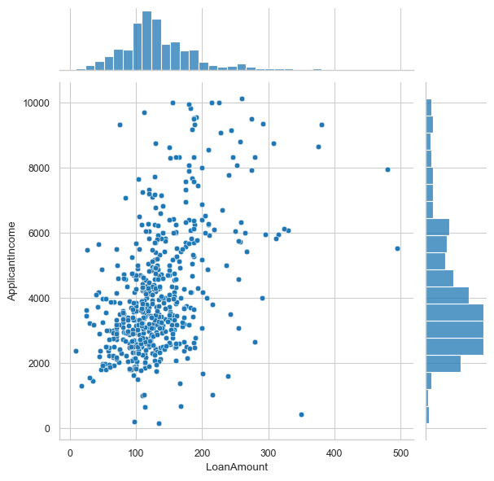
    


```python
sns.jointplot(x='LoanAmount', y='ApplicantIncome', data=df_temp, kind='reg')
```


    <seaborn.axisgrid.JointGrid at 0x1cfa9701e90>


    
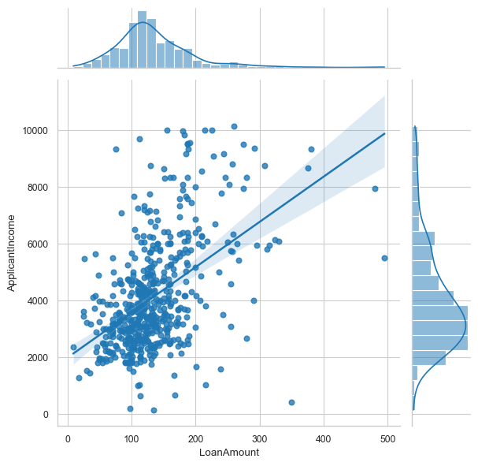
    


```python
sns.pairplot(df_temp, hue='Loan_Amount_Term', diag_kws={'bw': 1})
```


    <seaborn.axisgrid.PairGrid at 0x1cf9ac98f10>


    
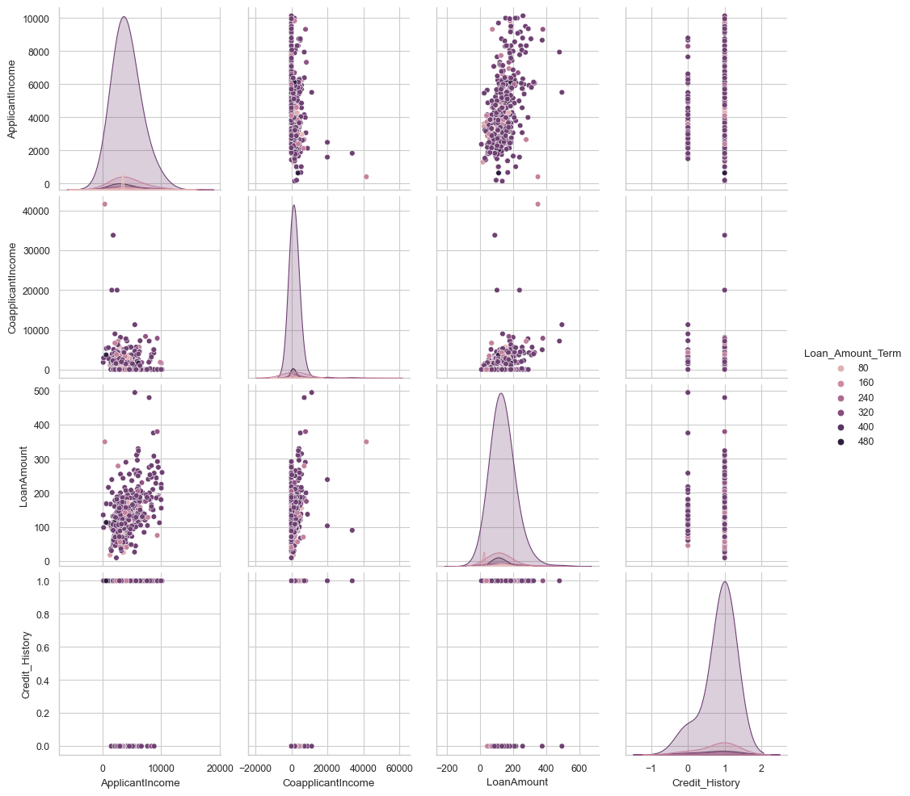
    


Plot Qualitative vs. Quantitative values together, any observations/insights?


```python
# Plot boxplots, violin plots, catplots
sns.boxplot(data=df_temp,x="Property_Area", y="LoanAmount")
```


    <Axes: xlabel='Property_Area', ylabel='LoanAmount'>


    
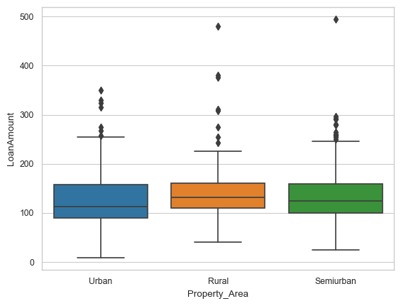
    


```python
# Plot boxplots, violin plots, catplots
sns.violinplot(data=df_temp,x="Married", y="LoanAmount")
```


    <Axes: xlabel='Married', ylabel='LoanAmount'>


    
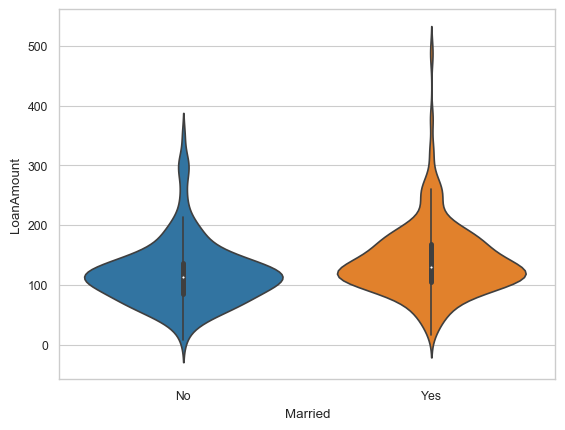
    


```python
sns.catplot(data=df_temp,x="Gender", y="LoanAmount", hue = "Dependents", kind="box")
```


    <seaborn.axisgrid.FacetGrid at 0x1cfb890c490>


    
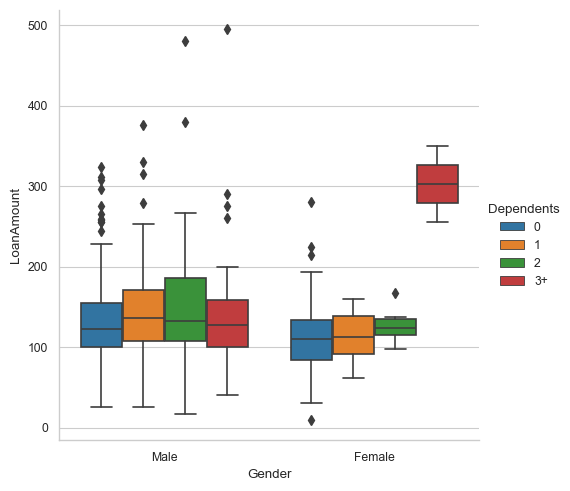
    


Data Preparation - Category to Numeric

Convert any ordinal features to numeric


```python
# Use OrdinalEncoder or substitution
from sklearn.preprocessing import LabelEncoder
from sklearn.preprocessing import OrdinalEncoder

le = LabelEncoder()
df_temp["Dependents_new"] = le.fit_transform(df_temp['Dependents'])
```


```python
dep = df_temp.Dependents.value_counts().sort_values(ascending=False)
dep_new = df_temp.Dependents_new.value_counts().sort_values(ascending=False)
pd.DataFrame([dep.index.values,dep_new.index.values,dep.values], index=['dependents','dependents_new','values']).T
```


<div>
<style scoped>
    .dataframe tbody tr th:only-of-type {
        vertical-align: middle;
    }

    .dataframe tbody tr th {
        vertical-align: top;
    }

    .dataframe thead th {
        text-align: right;
    }
</style>
<table border="1" class="dataframe">
  <thead>
    <tr style="text-align: right;">
      <th></th>
      <th>dependents</th>
      <th>dependents_new</th>
      <th>values</th>
    </tr>
  </thead>
  <tbody>
    <tr>
      <th>0</th>
      <td>0</td>
      <td>0</td>
      <td>321</td>
    </tr>
    <tr>
      <th>1</th>
      <td>2</td>
      <td>2</td>
      <td>95</td>
    </tr>
    <tr>
      <th>2</th>
      <td>1</td>
      <td>1</td>
      <td>89</td>
    </tr>
    <tr>
      <th>3</th>
      <td>3+</td>
      <td>3</td>
      <td>45</td>
    </tr>
    <tr>
      <th>4</th>
      <td>NaN</td>
      <td>4.00</td>
      <td>NaN</td>
    </tr>
  </tbody>
</table>
</div>


```python
# Using substitution
df_temp['Property_Area_new'] = df_temp['Property_Area']
df_temp = df_temp.replace({'Property_Area_new':{'Urban':0,'Rural':1,'Semiurban':2}})
```


```python
prop = df_temp.Property_Area.value_counts().sort_values(ascending=False)
prop_new = df_temp.Property_Area_new.value_counts().sort_values(ascending=False)
pd.DataFrame([prop.index.values,prop_new.index.values,prop.values], index=['prop_area','prop_area_new','values']).T
```


<div>
<style scoped>
    .dataframe tbody tr th:only-of-type {
        vertical-align: middle;
    }

    .dataframe tbody tr th {
        vertical-align: top;
    }

    .dataframe thead th {
        text-align: right;
    }
</style>
<table border="1" class="dataframe">
  <thead>
    <tr style="text-align: right;">
      <th></th>
      <th>prop_area</th>
      <th>prop_area_new</th>
      <th>values</th>
    </tr>
  </thead>
  <tbody>
    <tr>
      <th>0</th>
      <td>Semiurban</td>
      <td>2</td>
      <td>215</td>
    </tr>
    <tr>
      <th>1</th>
      <td>Urban</td>
      <td>0</td>
      <td>181</td>
    </tr>
    <tr>
      <th>2</th>
      <td>Rural</td>
      <td>1</td>
      <td>168</td>
    </tr>
  </tbody>
</table>
</div>


```python
df_temp.drop(['Dependents', 'Property_Area'],axis = 1, inplace = True)
```


```python
df_temp.columns
```


    Index(['Loan_ID', 'Gender', 'Married', 'Education', 'Self_Employed',
           'ApplicantIncome', 'CoapplicantIncome', 'LoanAmount',
           'Loan_Amount_Term', 'Credit_History', 'Loan_Status', 'Dependents_new',
           'Property_Area_new'],
          dtype='object')


Convert nominal features to numeric


```python
df_temp.dtypes
```


    Loan_ID               object
    Gender                object
    Married               object
    Education             object
    Self_Employed         object
    ApplicantIncome        int64
    CoapplicantIncome    float64
    LoanAmount           float64
    Loan_Amount_Term     float64
    Credit_History       float64
    Loan_Status           object
    Dependents_new         int32
    Property_Area_new      int64
    dtype: object


```python
# use pd.get_dummies, make sure to join with original dataset and/or drop columns not needed

df_categ = df_temp[['Gender', 'Married', 'Education', 'Self_Employed','Loan_Status']]
df_cat_dummies = pd.get_dummies(df_categ)
df_cat_dummies.head()
```


<div>
<style scoped>
    .dataframe tbody tr th:only-of-type {
        vertical-align: middle;
    }

    .dataframe tbody tr th {
        vertical-align: top;
    }

    .dataframe thead th {
        text-align: right;
    }
</style>
<table border="1" class="dataframe">
  <thead>
    <tr style="text-align: right;">
      <th></th>
      <th>Gender_Female</th>
      <th>Gender_Male</th>
      <th>Married_No</th>
      <th>Married_Yes</th>
      <th>Education_Graduate</th>
      <th>Education_Not Graduate</th>
      <th>Self_Employed_No</th>
      <th>Self_Employed_Yes</th>
      <th>Loan_Status_N</th>
      <th>Loan_Status_Y</th>
    </tr>
  </thead>
  <tbody>
    <tr>
      <th>0</th>
      <td>False</td>
      <td>True</td>
      <td>True</td>
      <td>False</td>
      <td>True</td>
      <td>False</td>
      <td>True</td>
      <td>False</td>
      <td>False</td>
      <td>True</td>
    </tr>
    <tr>
      <th>1</th>
      <td>False</td>
      <td>True</td>
      <td>False</td>
      <td>True</td>
      <td>True</td>
      <td>False</td>
      <td>True</td>
      <td>False</td>
      <td>True</td>
      <td>False</td>
    </tr>
    <tr>
      <th>2</th>
      <td>False</td>
      <td>True</td>
      <td>False</td>
      <td>True</td>
      <td>True</td>
      <td>False</td>
      <td>False</td>
      <td>True</td>
      <td>False</td>
      <td>True</td>
    </tr>
    <tr>
      <th>3</th>
      <td>False</td>
      <td>True</td>
      <td>False</td>
      <td>True</td>
      <td>False</td>
      <td>True</td>
      <td>True</td>
      <td>False</td>
      <td>False</td>
      <td>True</td>
    </tr>
    <tr>
      <th>4</th>
      <td>False</td>
      <td>True</td>
      <td>True</td>
      <td>False</td>
      <td>True</td>
      <td>False</td>
      <td>True</td>
      <td>False</td>
      <td>False</td>
      <td>True</td>
    </tr>
  </tbody>
</table>
</div>


```python
df = df_temp.join(df_cat_dummies)
```


```python
df.head()
```


<div>
<style scoped>
    .dataframe tbody tr th:only-of-type {
        vertical-align: middle;
    }

    .dataframe tbody tr th {
        vertical-align: top;
    }

    .dataframe thead th {
        text-align: right;
    }
</style>
<table border="1" class="dataframe">
  <thead>
    <tr style="text-align: right;">
      <th></th>
      <th>Loan_ID</th>
      <th>Gender</th>
      <th>Married</th>
      <th>Education</th>
      <th>Self_Employed</th>
      <th>ApplicantIncome</th>
      <th>CoapplicantIncome</th>
      <th>LoanAmount</th>
      <th>Loan_Amount_Term</th>
      <th>Credit_History</th>
      <th>Loan_Status</th>
      <th>Dependents_new</th>
      <th>Property_Area_new</th>
      <th>Gender_Female</th>
      <th>Gender_Male</th>
      <th>Married_No</th>
      <th>Married_Yes</th>
      <th>Education_Graduate</th>
      <th>Education_Not Graduate</th>
      <th>Self_Employed_No</th>
      <th>Self_Employed_Yes</th>
      <th>Loan_Status_N</th>
      <th>Loan_Status_Y</th>
    </tr>
  </thead>
  <tbody>
    <tr>
      <th>0</th>
      <td>LP001002</td>
      <td>Male</td>
      <td>No</td>
      <td>Graduate</td>
      <td>No</td>
      <td>5849</td>
      <td>0.00</td>
      <td>NaN</td>
      <td>360.00</td>
      <td>1.00</td>
      <td>Y</td>
      <td>0</td>
      <td>0</td>
      <td>False</td>
      <td>True</td>
      <td>True</td>
      <td>False</td>
      <td>True</td>
      <td>False</td>
      <td>True</td>
      <td>False</td>
      <td>False</td>
      <td>True</td>
    </tr>
    <tr>
      <th>1</th>
      <td>LP001003</td>
      <td>Male</td>
      <td>Yes</td>
      <td>Graduate</td>
      <td>No</td>
      <td>4583</td>
      <td>1508.00</td>
      <td>128.00</td>
      <td>360.00</td>
      <td>1.00</td>
      <td>N</td>
      <td>1</td>
      <td>1</td>
      <td>False</td>
      <td>True</td>
      <td>False</td>
      <td>True</td>
      <td>True</td>
      <td>False</td>
      <td>True</td>
      <td>False</td>
      <td>True</td>
      <td>False</td>
    </tr>
    <tr>
      <th>2</th>
      <td>LP001005</td>
      <td>Male</td>
      <td>Yes</td>
      <td>Graduate</td>
      <td>Yes</td>
      <td>3000</td>
      <td>0.00</td>
      <td>66.00</td>
      <td>360.00</td>
      <td>1.00</td>
      <td>Y</td>
      <td>0</td>
      <td>0</td>
      <td>False</td>
      <td>True</td>
      <td>False</td>
      <td>True</td>
      <td>True</td>
      <td>False</td>
      <td>False</td>
      <td>True</td>
      <td>False</td>
      <td>True</td>
    </tr>
    <tr>
      <th>3</th>
      <td>LP001006</td>
      <td>Male</td>
      <td>Yes</td>
      <td>Not Graduate</td>
      <td>No</td>
      <td>2583</td>
      <td>2358.00</td>
      <td>120.00</td>
      <td>360.00</td>
      <td>1.00</td>
      <td>Y</td>
      <td>0</td>
      <td>0</td>
      <td>False</td>
      <td>True</td>
      <td>False</td>
      <td>True</td>
      <td>False</td>
      <td>True</td>
      <td>True</td>
      <td>False</td>
      <td>False</td>
      <td>True</td>
    </tr>
    <tr>
      <th>4</th>
      <td>LP001008</td>
      <td>Male</td>
      <td>No</td>
      <td>Graduate</td>
      <td>No</td>
      <td>6000</td>
      <td>0.00</td>
      <td>141.00</td>
      <td>360.00</td>
      <td>1.00</td>
      <td>Y</td>
      <td>0</td>
      <td>0</td>
      <td>False</td>
      <td>True</td>
      <td>True</td>
      <td>False</td>
      <td>True</td>
      <td>False</td>
      <td>True</td>
      <td>False</td>
      <td>False</td>
      <td>True</td>
    </tr>
  </tbody>
</table>
</div>


```python
#drop original columns
df.drop(columns = df_categ.columns, axis = 1, inplace = True)
```


```python
df['Loan_ID'] = df['Loan_ID'].str.extract('(\d+)', expand=False).astype(float)
```


```python
df.head()
```


<div>
<style scoped>
    .dataframe tbody tr th:only-of-type {
        vertical-align: middle;
    }

    .dataframe tbody tr th {
        vertical-align: top;
    }

    .dataframe thead th {
        text-align: right;
    }
</style>
<table border="1" class="dataframe">
  <thead>
    <tr style="text-align: right;">
      <th></th>
      <th>Loan_ID</th>
      <th>ApplicantIncome</th>
      <th>CoapplicantIncome</th>
      <th>LoanAmount</th>
      <th>Loan_Amount_Term</th>
      <th>Credit_History</th>
      <th>Dependents_new</th>
      <th>Property_Area_new</th>
      <th>Gender_Female</th>
      <th>Gender_Male</th>
      <th>Married_No</th>
      <th>Married_Yes</th>
      <th>Education_Graduate</th>
      <th>Education_Not Graduate</th>
      <th>Self_Employed_No</th>
      <th>Self_Employed_Yes</th>
      <th>Loan_Status_N</th>
      <th>Loan_Status_Y</th>
    </tr>
  </thead>
  <tbody>
    <tr>
      <th>0</th>
      <td>1002.00</td>
      <td>5849</td>
      <td>0.00</td>
      <td>NaN</td>
      <td>360.00</td>
      <td>1.00</td>
      <td>0</td>
      <td>0</td>
      <td>False</td>
      <td>True</td>
      <td>True</td>
      <td>False</td>
      <td>True</td>
      <td>False</td>
      <td>True</td>
      <td>False</td>
      <td>False</td>
      <td>True</td>
    </tr>
    <tr>
      <th>1</th>
      <td>1003.00</td>
      <td>4583</td>
      <td>1508.00</td>
      <td>128.00</td>
      <td>360.00</td>
      <td>1.00</td>
      <td>1</td>
      <td>1</td>
      <td>False</td>
      <td>True</td>
      <td>False</td>
      <td>True</td>
      <td>True</td>
      <td>False</td>
      <td>True</td>
      <td>False</td>
      <td>True</td>
      <td>False</td>
    </tr>
    <tr>
      <th>2</th>
      <td>1005.00</td>
      <td>3000</td>
      <td>0.00</td>
      <td>66.00</td>
      <td>360.00</td>
      <td>1.00</td>
      <td>0</td>
      <td>0</td>
      <td>False</td>
      <td>True</td>
      <td>False</td>
      <td>True</td>
      <td>True</td>
      <td>False</td>
      <td>False</td>
      <td>True</td>
      <td>False</td>
      <td>True</td>
    </tr>
    <tr>
      <th>3</th>
      <td>1006.00</td>
      <td>2583</td>
      <td>2358.00</td>
      <td>120.00</td>
      <td>360.00</td>
      <td>1.00</td>
      <td>0</td>
      <td>0</td>
      <td>False</td>
      <td>True</td>
      <td>False</td>
      <td>True</td>
      <td>False</td>
      <td>True</td>
      <td>True</td>
      <td>False</td>
      <td>False</td>
      <td>True</td>
    </tr>
    <tr>
      <th>4</th>
      <td>1008.00</td>
      <td>6000</td>
      <td>0.00</td>
      <td>141.00</td>
      <td>360.00</td>
      <td>1.00</td>
      <td>0</td>
      <td>0</td>
      <td>False</td>
      <td>True</td>
      <td>True</td>
      <td>False</td>
      <td>True</td>
      <td>False</td>
      <td>True</td>
      <td>False</td>
      <td>False</td>
      <td>True</td>
    </tr>
  </tbody>
</table>
</div>


```python
corrmat = df.corr()
plt.figure(figsize=(10,10))
sns.heatmap(corrmat,  cmap="vlag", center = 0,  vmax=.9, square=True, linewidths=.5)
```


    <Axes: >


    
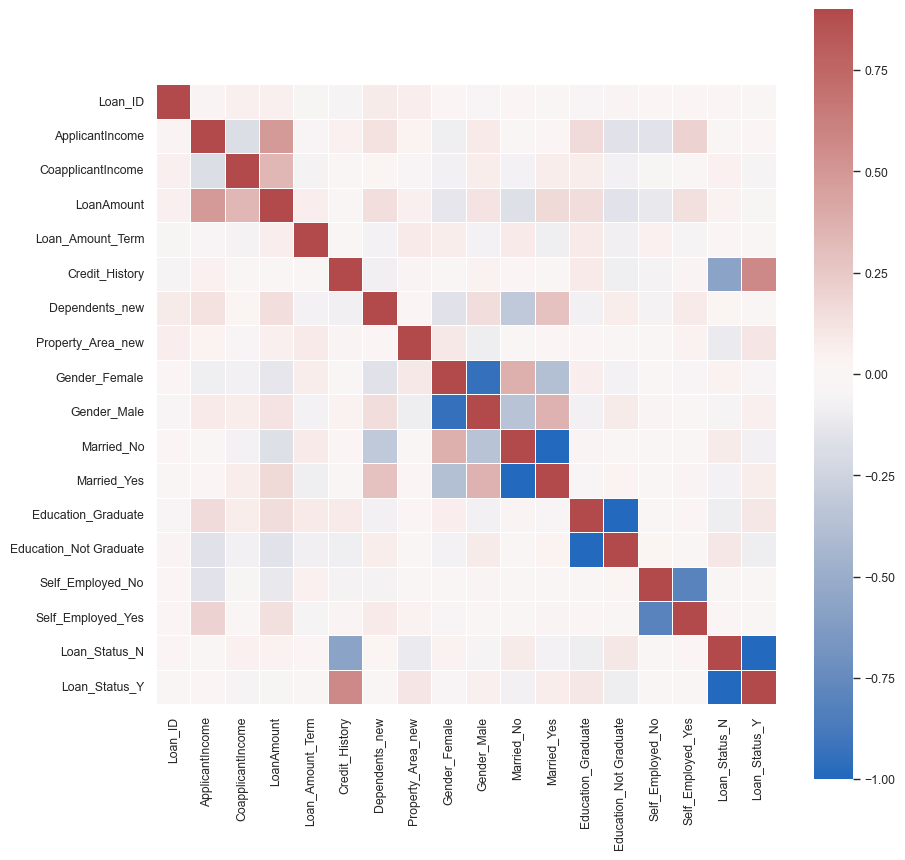
    


Scale the numeric columns excluding the target values


```python
df.shape
```


    (564, 18)


```python
df.ApplicantIncome.describe()
```


    count     564.00
    mean     4124.72
    std      1926.99
    min       150.00
    25%      2744.00
    50%      3638.50
    75%      5010.50
    max     10139.00
    Name: ApplicantIncome, dtype: float64


```python
df.describe()
```


<div>
<style scoped>
    .dataframe tbody tr th:only-of-type {
        vertical-align: middle;
    }

    .dataframe tbody tr th {
        vertical-align: top;
    }

    .dataframe thead th {
        text-align: right;
    }
</style>
<table border="1" class="dataframe">
  <thead>
    <tr style="text-align: right;">
      <th></th>
      <th>Loan_ID</th>
      <th>ApplicantIncome</th>
      <th>CoapplicantIncome</th>
      <th>LoanAmount</th>
      <th>Loan_Amount_Term</th>
      <th>Credit_History</th>
      <th>Dependents_new</th>
      <th>Property_Area_new</th>
    </tr>
  </thead>
  <tbody>
    <tr>
      <th>count</th>
      <td>564.00</td>
      <td>564.00</td>
      <td>564.00</td>
      <td>544.00</td>
      <td>550.00</td>
      <td>517.00</td>
      <td>564.00</td>
      <td>564.00</td>
    </tr>
    <tr>
      <th>mean</th>
      <td>1998.41</td>
      <td>4124.72</td>
      <td>1692.29</td>
      <td>133.81</td>
      <td>341.89</td>
      <td>0.84</td>
      <td>0.83</td>
      <td>1.06</td>
    </tr>
    <tr>
      <th>std</th>
      <td>568.48</td>
      <td>1926.99</td>
      <td>2979.23</td>
      <td>59.07</td>
      <td>65.76</td>
      <td>0.37</td>
      <td>1.12</td>
      <td>0.84</td>
    </tr>
    <tr>
      <th>min</th>
      <td>1002.00</td>
      <td>150.00</td>
      <td>0.00</td>
      <td>9.00</td>
      <td>12.00</td>
      <td>0.00</td>
      <td>0.00</td>
      <td>0.00</td>
    </tr>
    <tr>
      <th>25%</th>
      <td>1539.50</td>
      <td>2744.00</td>
      <td>0.00</td>
      <td>100.00</td>
      <td>360.00</td>
      <td>1.00</td>
      <td>0.00</td>
      <td>0.00</td>
    </tr>
    <tr>
      <th>50%</th>
      <td>1993.50</td>
      <td>3638.50</td>
      <td>1405.50</td>
      <td>124.00</td>
      <td>360.00</td>
      <td>1.00</td>
      <td>0.00</td>
      <td>1.00</td>
    </tr>
    <tr>
      <th>75%</th>
      <td>2468.25</td>
      <td>5010.50</td>
      <td>2337.00</td>
      <td>159.25</td>
      <td>360.00</td>
      <td>1.00</td>
      <td>2.00</td>
      <td>2.00</td>
    </tr>
    <tr>
      <th>max</th>
      <td>2990.00</td>
      <td>10139.00</td>
      <td>41667.00</td>
      <td>495.00</td>
      <td>480.00</td>
      <td>1.00</td>
      <td>4.00</td>
      <td>2.00</td>
    </tr>
  </tbody>
</table>
</div>


```python
# Separate the target variable(s)
df_x = df.drop(["Loan_Status_N","Loan_Status_Y"], axis=1)
y = df[["Loan_Status_N","Loan_Status_Y"]]    
```


```python
# Perform scaling

#Import the MinMax Scaler
from sklearn.preprocessing import MinMaxScaler, StandardScaler, RobustScaler

#Instantiate the Scaler
scaler = MinMaxScaler()

#Fit to the data set
scaler.fit(df_x)

#Apply to the data set
scaled_data = scaler.transform(df_x)


#Optional:
#Convert to DataFrame for viewing
df_minmax = pd.DataFrame(scaled_data, columns=df_x.columns, index=df_x.index)
```


```python
df_minmax.describe()
```


<div>
<style scoped>
    .dataframe tbody tr th:only-of-type {
        vertical-align: middle;
    }

    .dataframe tbody tr th {
        vertical-align: top;
    }

    .dataframe thead th {
        text-align: right;
    }
</style>
<table border="1" class="dataframe">
  <thead>
    <tr style="text-align: right;">
      <th></th>
      <th>Loan_ID</th>
      <th>ApplicantIncome</th>
      <th>CoapplicantIncome</th>
      <th>LoanAmount</th>
      <th>Loan_Amount_Term</th>
      <th>Credit_History</th>
      <th>Dependents_new</th>
      <th>Property_Area_new</th>
      <th>Gender_Female</th>
      <th>Gender_Male</th>
      <th>Married_No</th>
      <th>Married_Yes</th>
      <th>Education_Graduate</th>
      <th>Education_Not Graduate</th>
      <th>Self_Employed_No</th>
      <th>Self_Employed_Yes</th>
    </tr>
  </thead>
  <tbody>
    <tr>
      <th>count</th>
      <td>564.00</td>
      <td>564.00</td>
      <td>564.00</td>
      <td>544.00</td>
      <td>550.00</td>
      <td>517.00</td>
      <td>564.00</td>
      <td>564.00</td>
      <td>564.00</td>
      <td>564.00</td>
      <td>564.00</td>
      <td>564.00</td>
      <td>564.00</td>
      <td>564.00</td>
      <td>564.00</td>
      <td>564.00</td>
    </tr>
    <tr>
      <th>mean</th>
      <td>0.50</td>
      <td>0.40</td>
      <td>0.04</td>
      <td>0.26</td>
      <td>0.70</td>
      <td>0.84</td>
      <td>0.21</td>
      <td>0.53</td>
      <td>0.18</td>
      <td>0.80</td>
      <td>0.35</td>
      <td>0.65</td>
      <td>0.77</td>
      <td>0.23</td>
      <td>0.83</td>
      <td>0.12</td>
    </tr>
    <tr>
      <th>std</th>
      <td>0.29</td>
      <td>0.19</td>
      <td>0.07</td>
      <td>0.12</td>
      <td>0.14</td>
      <td>0.37</td>
      <td>0.28</td>
      <td>0.42</td>
      <td>0.39</td>
      <td>0.40</td>
      <td>0.48</td>
      <td>0.48</td>
      <td>0.42</td>
      <td>0.42</td>
      <td>0.38</td>
      <td>0.32</td>
    </tr>
    <tr>
      <th>min</th>
      <td>0.00</td>
      <td>0.00</td>
      <td>0.00</td>
      <td>0.00</td>
      <td>0.00</td>
      <td>0.00</td>
      <td>0.00</td>
      <td>0.00</td>
      <td>0.00</td>
      <td>0.00</td>
      <td>0.00</td>
      <td>0.00</td>
      <td>0.00</td>
      <td>0.00</td>
      <td>0.00</td>
      <td>0.00</td>
    </tr>
    <tr>
      <th>25%</th>
      <td>0.27</td>
      <td>0.26</td>
      <td>0.00</td>
      <td>0.19</td>
      <td>0.74</td>
      <td>1.00</td>
      <td>0.00</td>
      <td>0.00</td>
      <td>0.00</td>
      <td>1.00</td>
      <td>0.00</td>
      <td>0.00</td>
      <td>1.00</td>
      <td>0.00</td>
      <td>1.00</td>
      <td>0.00</td>
    </tr>
    <tr>
      <th>50%</th>
      <td>0.50</td>
      <td>0.35</td>
      <td>0.03</td>
      <td>0.24</td>
      <td>0.74</td>
      <td>1.00</td>
      <td>0.00</td>
      <td>0.50</td>
      <td>0.00</td>
      <td>1.00</td>
      <td>0.00</td>
      <td>1.00</td>
      <td>1.00</td>
      <td>0.00</td>
      <td>1.00</td>
      <td>0.00</td>
    </tr>
    <tr>
      <th>75%</th>
      <td>0.74</td>
      <td>0.49</td>
      <td>0.06</td>
      <td>0.31</td>
      <td>0.74</td>
      <td>1.00</td>
      <td>0.50</td>
      <td>1.00</td>
      <td>0.00</td>
      <td>1.00</td>
      <td>1.00</td>
      <td>1.00</td>
      <td>1.00</td>
      <td>0.00</td>
      <td>1.00</td>
      <td>0.00</td>
    </tr>
    <tr>
      <th>max</th>
      <td>1.00</td>
      <td>1.00</td>
      <td>1.00</td>
      <td>1.00</td>
      <td>1.00</td>
      <td>1.00</td>
      <td>1.00</td>
      <td>1.00</td>
      <td>1.00</td>
      <td>1.00</td>
      <td>1.00</td>
      <td>1.00</td>
      <td>1.00</td>
      <td>1.00</td>
      <td>1.00</td>
      <td>1.00</td>
    </tr>
  </tbody>
</table>
</div>


```python
# Join back the target variables
df_prep = df_minmax.join(y)

df_prep.head()
```


<div>
<style scoped>
    .dataframe tbody tr th:only-of-type {
        vertical-align: middle;
    }

    .dataframe tbody tr th {
        vertical-align: top;
    }

    .dataframe thead th {
        text-align: right;
    }
</style>
<table border="1" class="dataframe">
  <thead>
    <tr style="text-align: right;">
      <th></th>
      <th>Loan_ID</th>
      <th>ApplicantIncome</th>
      <th>CoapplicantIncome</th>
      <th>LoanAmount</th>
      <th>Loan_Amount_Term</th>
      <th>Credit_History</th>
      <th>Dependents_new</th>
      <th>Property_Area_new</th>
      <th>Gender_Female</th>
      <th>Gender_Male</th>
      <th>Married_No</th>
      <th>Married_Yes</th>
      <th>Education_Graduate</th>
      <th>Education_Not Graduate</th>
      <th>Self_Employed_No</th>
      <th>Self_Employed_Yes</th>
      <th>Loan_Status_N</th>
      <th>Loan_Status_Y</th>
    </tr>
  </thead>
  <tbody>
    <tr>
      <th>0</th>
      <td>0.00</td>
      <td>0.57</td>
      <td>0.00</td>
      <td>NaN</td>
      <td>0.74</td>
      <td>1.00</td>
      <td>0.00</td>
      <td>0.00</td>
      <td>0.00</td>
      <td>1.00</td>
      <td>1.00</td>
      <td>0.00</td>
      <td>1.00</td>
      <td>0.00</td>
      <td>1.00</td>
      <td>0.00</td>
      <td>False</td>
      <td>True</td>
    </tr>
    <tr>
      <th>1</th>
      <td>0.00</td>
      <td>0.44</td>
      <td>0.04</td>
      <td>0.24</td>
      <td>0.74</td>
      <td>1.00</td>
      <td>0.25</td>
      <td>0.50</td>
      <td>0.00</td>
      <td>1.00</td>
      <td>0.00</td>
      <td>1.00</td>
      <td>1.00</td>
      <td>0.00</td>
      <td>1.00</td>
      <td>0.00</td>
      <td>True</td>
      <td>False</td>
    </tr>
    <tr>
      <th>2</th>
      <td>0.00</td>
      <td>0.29</td>
      <td>0.00</td>
      <td>0.12</td>
      <td>0.74</td>
      <td>1.00</td>
      <td>0.00</td>
      <td>0.00</td>
      <td>0.00</td>
      <td>1.00</td>
      <td>0.00</td>
      <td>1.00</td>
      <td>1.00</td>
      <td>0.00</td>
      <td>0.00</td>
      <td>1.00</td>
      <td>False</td>
      <td>True</td>
    </tr>
    <tr>
      <th>3</th>
      <td>0.00</td>
      <td>0.24</td>
      <td>0.06</td>
      <td>0.23</td>
      <td>0.74</td>
      <td>1.00</td>
      <td>0.00</td>
      <td>0.00</td>
      <td>0.00</td>
      <td>1.00</td>
      <td>0.00</td>
      <td>1.00</td>
      <td>0.00</td>
      <td>1.00</td>
      <td>1.00</td>
      <td>0.00</td>
      <td>False</td>
      <td>True</td>
    </tr>
    <tr>
      <th>4</th>
      <td>0.00</td>
      <td>0.59</td>
      <td>0.00</td>
      <td>0.27</td>
      <td>0.74</td>
      <td>1.00</td>
      <td>0.00</td>
      <td>0.00</td>
      <td>0.00</td>
      <td>1.00</td>
      <td>1.00</td>
      <td>0.00</td>
      <td>1.00</td>
      <td>0.00</td>
      <td>1.00</td>
      <td>0.00</td>
      <td>False</td>
      <td>True</td>
    </tr>
  </tbody>
</table>
</div>


```python
### Write the prepared dataset into a new file
#Save as a csv
df_prep.to_csv('\\Users\\cbaruc\\Downloads\\EDA\loans_train_prep.csv')
```


```python

```
